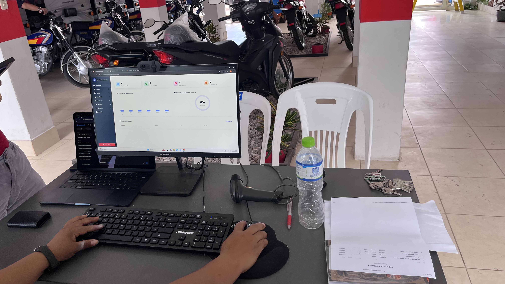
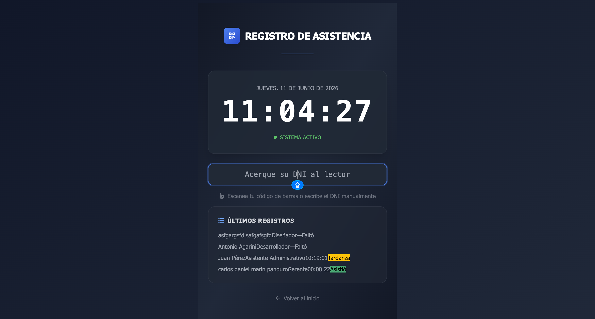
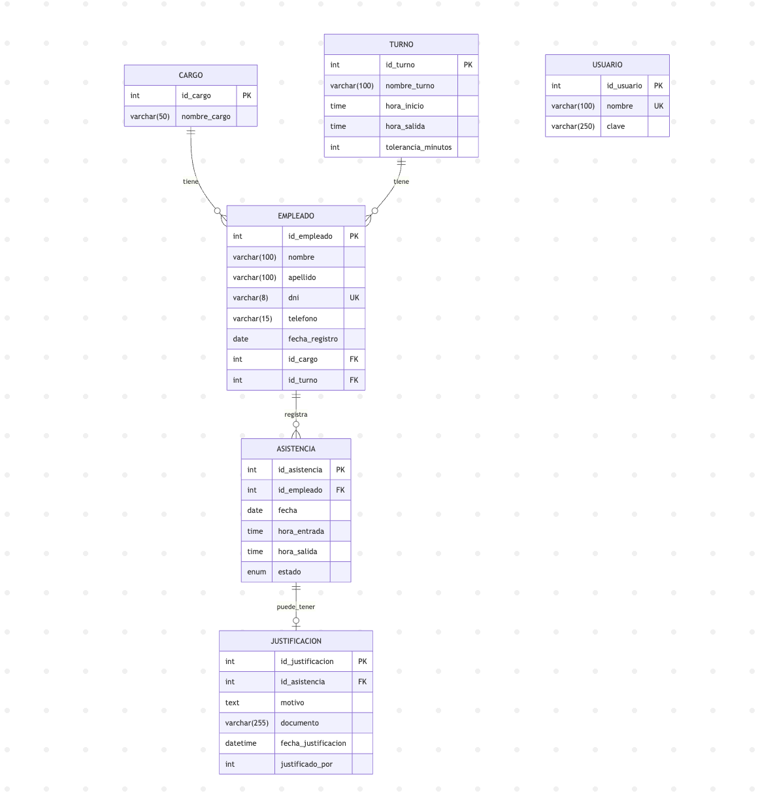
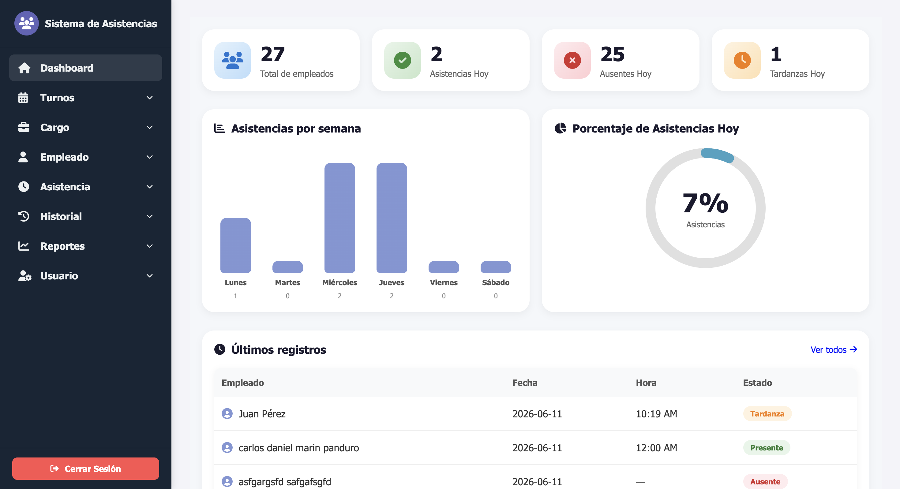
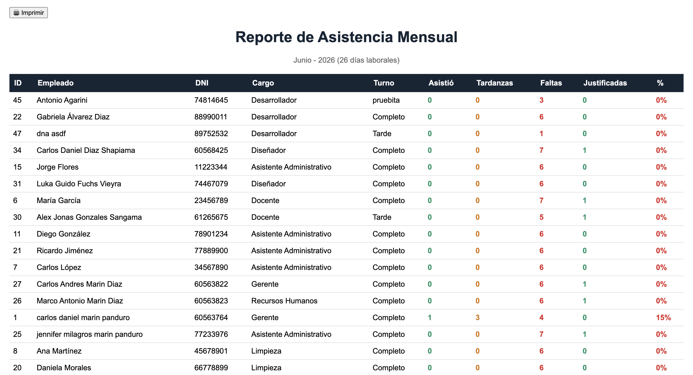
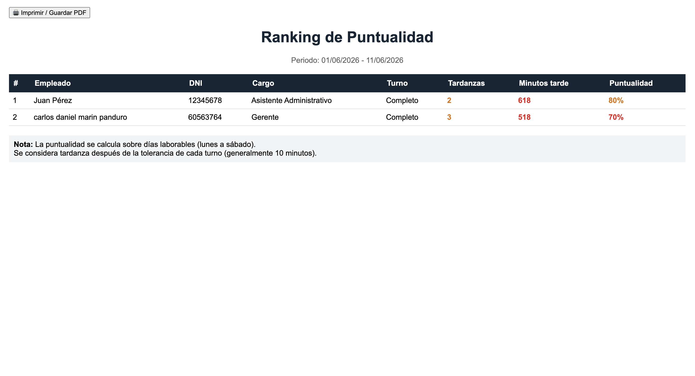

<div align="center">

#  SISTEMA DE GESTIÓN DE ASISTENCIAS - MOTO-CARS INVERSIONES
[](LICENSE)


</div>

<div align="center">

###  Backend & Base de Datos


### Frontend


[](https://uiverse.io/)


### Herramientas de Desarrollo


###  Gestión del Proyecto


###  Seguridad


###  Métricas del Proyecto


###  Autor


</div>

---

##  Sobre el Proyecto

Sistema web de control de asistencias desarrollado para **MOTO-CARS INVERSIONES**, empresa dedicada a la venta de motos lineales y motokares de la marca Honda. Gestiona a sus **20 empleados** entre vendedores, mecánicos, administrativos y personal de limpieza.

---

##  El Problema

| # | Problema | Consecuencia |
|---|----------|--------------|
| 1 | Registros manuales en papel | Errores y posibles falsificaciones |
| 2 | Sin control en tiempo real | El administrador no sabía quién llegó tarde o faltó |
| 3 | Cálculo laborioso | El dueño perdía horas sumando tardanzas y horas extras |
| 4 | Pérdida de información | Las hojas se extraviaban o dañaban |
| 5 | Sin justificaciones | No quedaba registro de faltas por motivos de salud |
| 6 | Reportes manuales | Generarlos tomaba horas y siempre tenían errores |

>  *"Un sistema sencillo donde los empleados marquen su entrada y salida con su DNI, que me avise quién llega tarde, que me calcule las faltas solo, y que me genere reportes sin que yo tenga que hacer cuentas a mano."*
> — Dueño de MOTO-CARS INVERSIONES

---

##  La Solución

| Módulo | Descripción |
|--------|-------------|
|  **Autenticación** | Login seguro con contraseñas encriptadas (`password_hash`) |
|  **Empleados** | CRUD completo: registrar, editar, eliminar y buscar por nombre o DNI |
|  **Cargos** | Gestión de puestos laborales (vendedor, mecánico, administrativo) |
|  **Turnos** | Configuración de horarios con entrada, salida y tolerancia de tardanza |
|  **Asistencia con Lector** | Marcación con DNI mediante lector de código de barras y detección automática de tardanza |
|  **Historial** | Consulta de asistencias pasadas por fecha específica |
|  **Justificaciones** | El administrador puede justificar faltas con motivo y queda registro permanente |
|  **Reportes** | Exportación a Excel y PDF: asistencia por fecha, resumen mensual y ranking de puntualidad |
|  **Automatización (CRON)** | Marca faltas y salidas automáticamente según el horario de cada turno |
|  **Dashboard** | Estadísticas en tiempo real, gráficos y últimos registros (actualización AJAX cada 30 seg) |

---

##  Stack Tecnológico

| Herramienta | Versión | Uso |
|-------------|---------|-----|
| **PHP** | 8.2 | Backend, POO, MVC desde cero |
| **MySQL / MariaDB** | 10.4 | Base de datos relacional |
| **Apache** | 2.4 | Servidor web |
| **XAMPP** | 8.2 | Entorno local (Apache + MySQL + PHP) |
| **JavaScript** | ES6 | Interactividad, AJAX y actualizaciones en tiempo real |
| **HTML5 / CSS3** | — | Estructura y diseño responsive |
| **SweetAlert2** | 11 | Modales y alertas personalizadas |
| **FontAwesome** | 6.5 | Iconografía |
| **Git / GitHub** | — | Control de versiones y repositorio remoto |
| **Trello** | — | Gestión de tareas con metodología ágil |
| **Figma** | — | Diseño UI/UX y prototipado |
| **Draw.io** | — | Diagrama Entidad-Relación (DER) |

---

##  Arquitectura MVC

El sistema sigue el patrón **Modelo – Vista – Controlador** implementado desde cero en PHP puro, sin frameworks.

```
SISTEMA-ASISTENCIA/
├── app/
│   ├── config/         # Configuración (BD, constantes)
│   ├── controllers/    # Controladores (lógica de negocio)
│   ├── core/           # Clases base (Router, Controller, Model, Database)
│   ├── models/         # Modelos (consultas SQL)
│   └── views/          # Vistas HTML/CSS/JS
│       ├── layouts/    # Headers y footers compartidos
│       └── [módulos]/  # Vistas específicas por módulo
├── public/
│   ├── css/            # Estilos del sistema
│   ├── js/             # Scripts JavaScript
│   └── images/         # Recursos gráficos
├── .env                # Variables de entorno
├── .htaccess           # Reescritura de URLs
└── cron_asistencia.php # Tareas automáticas (CRON)
```

**Flujo de una petición:**
1. El usuario escribe una URL
2. `.htaccess` redirige todo a `index.php`
3. El Router determina qué controlador ejecutar
4. El controlador consulta al modelo (base de datos)
5. El controlador carga la vista con los datos
6. Se renderiza el HTML al usuario

---

##  Instalación

### Requisitos previos

| Requisito | Versión mínima |
|-----------|----------------|
| XAMPP | 8.2 o superior |
| PHP | 8.0 o superior |
| MySQL / MariaDB | 10.4 o superior |
| Navegador | Chrome, Firefox, Edge o Safari |

### Pasos

```bash
# 1. Clonar el repositorio
git clone https://github.com/carlosdmarin/SISTEMA-ASISTENCIA.git
cd SISTEMA-ASISTENCIA

# 2. Copiar el archivo de configuración
cp .env.example .env

# 3. Editar .env con tus credenciales
DB_HOST=localhost
DB_NAME=sistema_de_asistencia
DB_USER=root
DB_PASS=

# 4. Iniciar XAMPP (Apache y MySQL)

# 5. Crear la base de datos
# Abrir phpMyAdmin → ejecutar el script SQL (ver sección Base de Datos)

# 6. Copiar el proyecto a htdocs
# Windows: C:\xampp\htdocs\SISTEMA-ASISTENCIA
# Mac:     /Applications/XAMPP/htdocs/SISTEMA-ASISTENCIA

# 7. Acceder al sistema en el navegador
http://localhost/SISTEMA-ASISTENCIA
```

>  **Credenciales por defecto:** usuario `admin` / contraseña `admin123`

---

###  Configuración del CRON (Tareas Automáticas)

** Mac / Linux**
```bash
crontab -e
# Agregar la siguiente línea (ejecuta todos los días a las 6:00 PM):
0 18 * * * /Applications/XAMPP/bin/php /ruta/a/SISTEMA-ASISTENCIA/cron_asistencia.php
```

** Windows (Programador de tareas)**
```
Abrir: taskschd.msc → Crear tarea básica
  - Nombre:      Sistema Asistencias
  - Disparador:  Diario a las 6:00 PM
  - Programa:    C:\xampp\php\php.exe
  - Argumentos:  -f "C:\xampp\htdocs\SISTEMA-ASISTENCIA\cron_asistencia.php"
```

---

##  Base de Datos

### Script SQL

```sql
-- =============================================
-- CREACIÓN DE LA BASE DE DATOS
-- =============================================

CREATE DATABASE IF NOT EXISTS sistema_de_asistencia
  DEFAULT CHARACTER SET utf8mb4
  DEFAULT COLLATE utf8mb4_general_ci;

USE sistema_de_asistencia;

-- TABLA: TURNO
CREATE TABLE TURNO (
    id_turno           INT PRIMARY KEY AUTO_INCREMENT,
    nombre_turno       VARCHAR(100) NOT NULL,
    hora_inicio        TIME NOT NULL,
    hora_salida        TIME NOT NULL,
    tolerancia_minutos INT DEFAULT 10
);

-- TABLA: CARGO
CREATE TABLE CARGO (
    id_cargo    INT AUTO_INCREMENT PRIMARY KEY,
    nombre_cargo VARCHAR(50) NOT NULL
);

-- TABLA: USUARIO
CREATE TABLE USUARIO (
    id_usuario INT PRIMARY KEY AUTO_INCREMENT,
    nombre     VARCHAR(100) UNIQUE NOT NULL,
    clave      VARCHAR(250) NOT NULL
);

-- TABLA: EMPLEADO
CREATE TABLE EMPLEADO (
    id_empleado    INT AUTO_INCREMENT PRIMARY KEY,
    nombre         VARCHAR(100) NOT NULL,
    apellido       VARCHAR(100) NOT NULL,
    dni            VARCHAR(8) UNIQUE NOT NULL,
    telefono       VARCHAR(15) NOT NULL,
    fecha_registro DATE DEFAULT (CURRENT_DATE) NOT NULL,
    id_cargo       INT NOT NULL,
    id_turno       INT NOT NULL,
    FOREIGN KEY (id_turno) REFERENCES TURNO(id_turno),
    FOREIGN KEY (id_cargo) REFERENCES CARGO(id_cargo)
);

-- TABLA: ASISTENCIA
CREATE TABLE ASISTENCIA (
    id_asistencia INT AUTO_INCREMENT PRIMARY KEY,
    id_empleado   INT NOT NULL,
    fecha         DATE DEFAULT (CURRENT_DATE) NOT NULL,
    hora_entrada  TIME DEFAULT NULL,
    hora_salida   TIME NULL,
    estado        ENUM('asistio', 'tardanza', 'falto') NOT NULL,
    FOREIGN KEY (id_empleado) REFERENCES EMPLEADO(id_empleado) ON DELETE CASCADE,
    UNIQUE KEY unique_asistencia_dia (id_empleado, fecha)
);

-- TABLA: JUSTIFICACION
CREATE TABLE JUSTIFICACION (
    id_justificacion   INT AUTO_INCREMENT PRIMARY KEY,
    id_asistencia      INT NOT NULL,
    motivo             TEXT NOT NULL,
    documento          VARCHAR(255) NULL,
    fecha_justificacion DATETIME DEFAULT CURRENT_TIMESTAMP,
    justificado_por    INT NOT NULL,
    FOREIGN KEY (id_asistencia) REFERENCES ASISTENCIA(id_asistencia) ON DELETE CASCADE
);
```
--- 
### Fotos del Negocio
| Diagrama MER | Asistencia con Lector |
|:---------:|:---------------------:|
|  |  |
--- 

### Diagramas
| Diagrama MER | Asistencia con Lector |
|:---------:|:---------------------:|
|  |  |
--- 

### Cardinalidades

| Relación | Tipo | Explicación |
|----------|------|-------------|
| CARGO → EMPLEADO | `1 : N` | Un cargo puede tener muchos empleados |
| TURNO → EMPLEADO | `1 : N` | Un turno puede tener muchos empleados |
| EMPLEADO → ASISTENCIA | `1 : N` | Un empleado tiene muchos registros de asistencia |
| ASISTENCIA → JUSTIFICACION | `1 : 1` | Una asistencia puede tener como máximo una justificación |

---

##  Capturas de Pantalla

| Dashboard | Asistencia con Lector |
|:---------:|:---------------------:|
|  |  |

| Resumen Mensual | Ranking de Puntualidad |
|:--------------:|:----------------------:|
|  |  |


---

##  Logros del Proyecto

|  Logro | Descripción |
|---------|-------------|
| **100% funcional** | Todos los módulos están operativos |
| **MVC desde cero** | Sin frameworks: código limpio, ordenado y escalable |
| **AJAX en tiempo real** | Tablas se actualizan cada 30 segundos sin recargar la página |
| **CRON automático** | Faltas y salidas se registran solas según el horario de cada turno |
| **Reportes profesionales** | Exportación a Excel y PDF con diseño corporativo |
| **Justificaciones** | Registro permanente de motivos de inasistencia |
| **Responsive** | Funciona correctamente en móvil, tablet y desktop |
| **Seguridad** | Contraseñas encriptadas y prepared statements contra SQL Injection |

---

##  Gestión del Proyecto

Este proyecto se gestionó con **metodología ágil** usando Trello y se diseñó con un prototipo en Figma antes de implementar.

| Herramienta | Enlace |
|-------------|--------|
|  Tablero Trello | [Ver tablero](https://trello.com/b/YEKBDLXE/sistema-asistencia) |
|  Prototipo Figma | [Ver diseño](https://www.figma.com/design/VoClaSs4Tfc3ZZ3iVfCmuU/PROYECTO-ASISTENCIA?node-id=41-1559&t=BYIrH7qSuvFSXNrC-0) |

---

##  Autores

| Nombre | Rol | Contacto |
|--------|-----|----------|
| **Carlos Marín** | Desarrollo completo | [GitHub](https://github.com/carlosdmarin) |
| **MOTO-CARS INVERSIONES** | Cliente / Caso de estudio | 931297608 |

---

##  Licencia

Este proyecto está bajo la licencia **MIT**.
Puedes usarlo, modificarlo y distribuirlo libremente.

---

##  Contacto

| Medio | Enlace |
|-------|--------|
|  Email | carlosdmarin@email.com |
|  GitHub | [github.com/carlosdmarin](https://github.com/carlosdmarin) |
|  LinkedIn | [linkedin.com/in/carlosdmarin](https://linkedin.com/in/carlosdmarin) |

---
 **Si este proyecto te fue útil, dale una estrella en GitHub y compártelo.**

*© 2026 — Sistema de Gestión de Asistencias para MOTO-CARS INVERSIONES*

</div>
